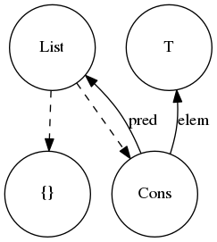

class: middle

#STACC

???

Image of the staccs


---
class: top

#STACC is 

* Nobel core calculus for FP languages
  - Foundation to experiment new FP lang ideas

* Alternative interpretation
    - Not founded on the Lambda calculus

???

Takes the unorthodox approach of not being rooted on Lambda C

Is a core calculus to support the building of FP languages


---

#Why Stacc

* Wide conceptual gap between Lambda Calculus and advanced FP languages
    - Stacc sits in between narrowing gap

* Unifies many PL constructs in a minimalistic and approachable way
    - Familiar notation and semantics rooted on Set theory


???

Do we really need more type theories?

As an FP practitioner outside academia I've found this wide gap

---

#STACC: 

* Set Theoretic

* Algebraic

* Constructive

* Calculus

---

# Set theoretic

* Primary building block is the set of predicates

* Set semantics
    - e.g. Set union is _function application_

--

* <p><i><b>ST</b></i> also for Structural!</p>

---

# Algebraic

* Lambda Calculus has application and product
    - λx. xyz

* STACC has application, product and coproduct

* Coproduct: conditional values
```sh
    b = | 0  if a < 0
        | a  otherwise
```

???

Disjoint union

---

# Constructive

* Inspired by Intuitionistic Type Theory

* In order to have a proof we need to _*construct*_ it

* Evaluation is successful if it doesn't result in absurdity

* i.e. expression `2 < 1` is _impossible_ to construct

--

<p class="large red"> Blow up evaluation!</p>

???

Let's see graphical example of a constructive smaller than

LEGO time

Just as well your program should collapse.

STATIC TYPING typechecker's job this doesn't happen at runtime

---
#First contact

```sh
    natTuple = { a ∈ Nat, b ∈ Nat }

    orderedTuple = natTuple ∪ { a ∈ (< b) }

    orderedTuple = {
        a ∈ Nat
        b ∈ Nat
        a ∈ (< b)      // a < b
    }

```

---
#Propositions as types

##x ∈ P ⇔ P(x)

* The values that hold for the predicate define the domain of the type

* Nat and (< b) are predicates

--

* Nat and (< b) are types


---
#Union as application
```sh
  orderedTuple = {
        a ∈ Nat
        b ∈ Nat
        a ∈ (< b)
  }

  `bounded by 5` = orderedTuple ∪ { b = 5 }

```

--

```sh
  `bounded by 5` = {
        a ∈ Nat
        b ∈ Nat
        b = 5
        a ∈ (< 5)
  }

```

---
#Asserting the unknown

y: Nat

t = 'bounded by 5' u { a = y }

---
#Asserting the unknown

y: Nat

~~t = 'bounded by 5' u { a = y }~~

---
#Coproduct to the rescue

```sh
{
    y: Nat

    bb5 = `bounded by 5` 

    t = | bb5 u { a = y }   if y < bb5.b
        |
        | bb5 u { a = 5 }   otherwise
}
```

---

#Properties vs Booleans

* Commonly logic and properties represented as booleans

    - Boolean blindness issue

* We want predicates enforceable by compiler

* Line between type and refinement blurred

---

# Decidability

* Add-hoc constrains
    - i.e. not formally verified

* Type level enforcement of business invariants

* Push invariant checking to the caller
    - Function logic is simpler as domain is constrained

---

# Inversion of Optionality

* Mainstream approach: function handles optionality

* Principled

    - squareRoot: Double => Option[Double]

--

* The hidden surprise

    - squareRoot: Double => Double

--

* We should push up optionality to the caller

   - squareRoot: NonNegativeDouble => NonNegativeDouble

--

* Usually achieved with **newtypes**

---

#Totality is only part of the solution

* Implicit invariants have a cognitive cost

   - getInvoices: [Order] -> [Invoice]

--

* Make the invariant __explicit__

   - getInvoice: (o: Order, Fullfilled(o)) -> Invoice

---

# Newtype shortcomings


* No support for intersection and conjuction of properties
    - e.g. with multiple invariants
```haskell
        newtype propA 
        newtype propB
```

* We cannot create a type intersection
    - It would require newtype `propA_and_propB`

???

There are some fringe ways

Dotty might be do things better

---

background-image: url(img/uncle-bob.png)

---
class:middle

## We are missing composability at the type level

---

#Construct our example in Stacc

## We will need:

    - Numbers

    - smaller than

## Building blocks:

    - Empty set {}

    - Predicates on Vars

    - Disjunction

---

# Peano Numbers

* Zero is the empty set {}

* Succ is the successors of the previous number.
  - A successor is an object with variable _*pred*_ pointing to predecessor


```sh 
   zero =                   {} 
   one  =          { pred = zero }
   two  = { pred = one }
   two  = { pred = { pred = {} } } 
```

???

 * All the data structures we can create are finite

 ... But where are the types? We haven't created any abstraction about the Naturals.

---

# Nat Type

* All the data structures we have created are finite

* We want to specify `x ∈ Nat`

* Let's try:

```sh
   Nat = {} | Succ

   Succ = ???
```

---

# Inductive types

* References to create induction
    - References to structures in the tree gives us recursion

```sh
    Nat = {} | Succ
    Succ = { pred: Nat }
```

--

* Because we are only in the realm of data this is safe

    - Structural recursion

    - Gives us a solid foundation.

???

---
#Nats and two
.left-column[ ]

.right-column[]


---

#Succ in STACC

* Nat -> Nat *too powerful* for the induction step
    - It could be adding two or never terminate

* In Stacc Succ has fixed-point, data nature
    - Can only reference preexisting Nat
    - Data layering

* Well formed tree structure

--

* Maybe we need a signature for induction steps

---

# Creating our own constraint

* Let's create smaller than

```sh
    < = { a: Nat
          b: Nat

          => | {}               if  a  = {}, b /= {}
             | {} ∈ {}          if  b  = {}
             | a.pred < b.pred  if  b /= {}, a /= {}
    }
```
* In the second clause we introduce __absurdity ⊥__

* All the paths in the disjunction must be disjoint
    - i.e. no overlap.
    - More principled than the usual fall through case statements

---
class:middle

##"Fast and loose __proving__ is morally correct"

???

  Paraphrasing the famous FP quote from bananas &  & barbed wire

---

# Parametricity

* A variable has a membership constrain on another variable which is a Set

* No different semantics than other values
    - You can compare assign, copy, etc.

```sh
{

    T ∈  Set
    a ∈ T
}
```

---

# Lists

```sh
{
    List  = {} | Cons
    Cons = { pred ∈ List
             elem ∈ T
             T    ∈ Set }
}
`
```

---

#Nat List adjoint

.left-column[ ]

.right-column[]

---

# Subtyping 

```sh
equalNats = { 
      a ∈ Nat
      b ∈ Nat
      a = b
}
```
--

```sh
listOfSize = { 
      size ∈ Nat
      list ∈ List
      
      equalNats ∪ {
        a = size
        b = list
      }
}
```

---

.left-column[
```sh
listOfSize ∪ {
  size = {
      pred = {
          pred = {}
      }
  }

  list = {
    T = String
    elem = "foo" }
    pred = {
        T = String
        elem = "bar"
        pred = {}
    }
}
```
]

.right-column[

</br>

]

???

this is using size

---

# Higher ranks

* Chained membership relationships result in higher ranks

```sh
{

    U ∈  Set
    T ∈  U

    a ∈ T
}
```

---

#E.g. Identity

```sh
id = { 
    T ∈ Set
    x ∈ T 
     => x
}
```
--

* We apply the set property same as any other value

```sh

idNat = id ∪ { T = Nat }

idNat = {
    T ∈ Set
    x ∈ T 
    T = Nat 
    => x
}
```

???

---

# Thank you

* Demand ad-hoc constraints

--

* Fast and loose proving is morally correct

--

* Stack your blocks and construct types
</br>
</br>
</br>
<p class="github center"><b>https://github.com/landerlo/stacc</b></p>
<p class="blue center"><b>@landerlo</b></p>

